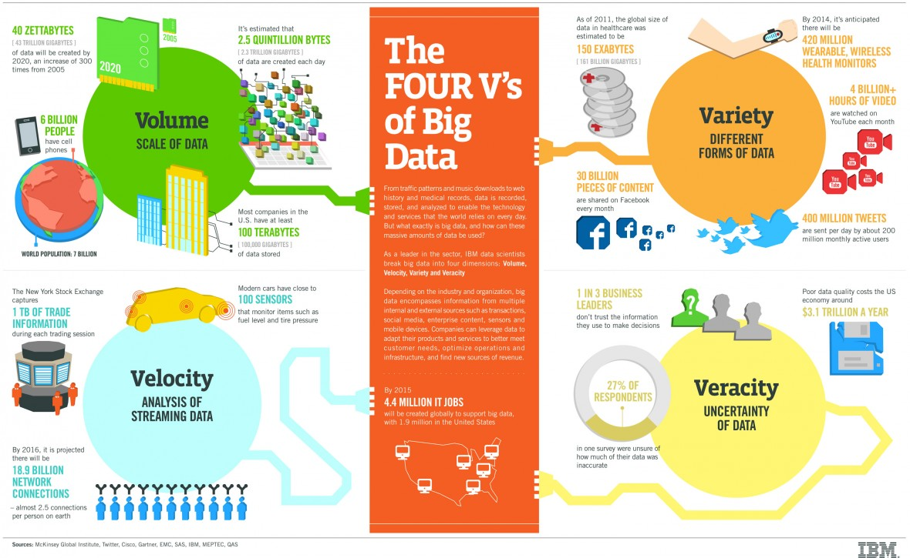
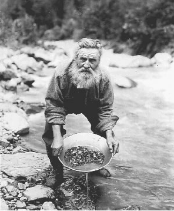
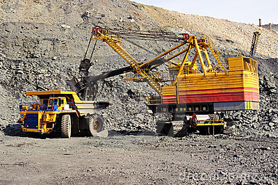
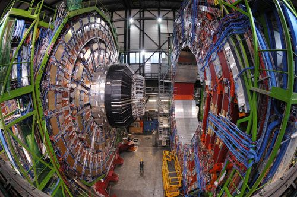
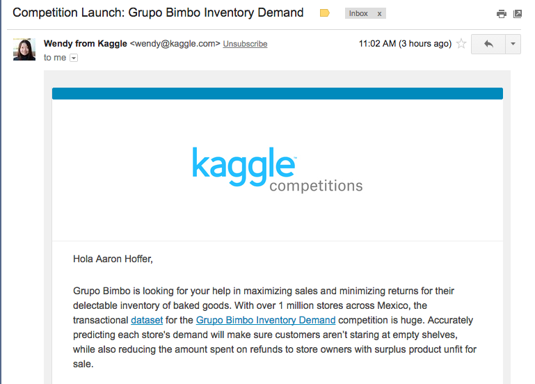

# Big Data
An opinionated overview

---

## What is big data?
### Volume, Velocity, Variety (and Veracity)

### Simple Definition
My operational definition of big data is *data too big to fit into the memory of one computer*. The implication is that you need _distributed computing_ to process the data.

## Why big data at all?

### Strong signal

Data used to come from carefully crafted and potentially expensive experiments. Think of drug trial studies, counting the number of salmon in a river, or launching rockets to gather dust samples from the stratosphere. 
  
**Small data** was valuable because the experiments were designed to have a high _signal-to-noise ratio_. Mining knowledge from small data is like finding a gold nugget in your pan. Analyzing small data is something one person can do with a personal computer. This is the world the S programming language (which later became the R programming language) was born into.

  
### Weak signal

Mining **big data** (even if it comes from carefully design experiments) is like mining and refining low-grade gold ore. It takes a lot of processing to get anything valuable from it. It has a low _signal-to-noise ratio_. You need data centers and a group of people to manage them.

### Pioneers in big data

Physicists have been mining big data for a long time. They build custom hardware, wrote custom software, and invented novel algorithms. Experiments like CERN and LIGO spring to mind. Big data can lead to some of humanity's crowning achievements like proving the existence of the Higgs boson or gravity waves. 

### Corporate data miners 

- Typically, mining big data is used to squeak out a couple extra percent ROI, attain slightly higher conversion rates, or get an additional 0.5% of the vote. 
- Improving your marketing campaign by a couple percent is important when a few percent means millions of dollars in new revenue.
- Most data to be mined is junk data, like click streams, twitter posts, or inventory histories.
- Most data mining is about targeted marketing or increasing logistics efficiencies. If you want a career in data science, this is what you can expect:

  
  