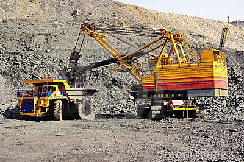
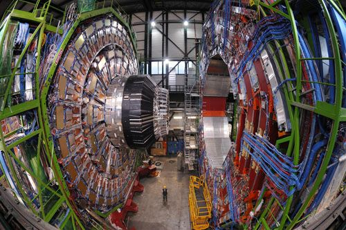
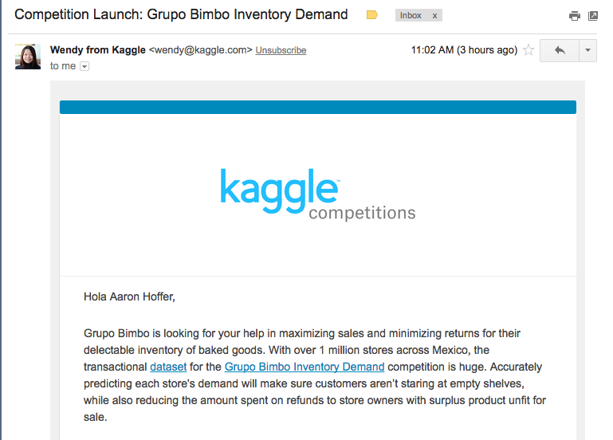

# ~~Big~~ Data and Machine Learning with R

This presentation is part introduction to R, part introduction to machine learning.
The introduction gives an overview of data science and some thoughts on data versus big data. 
  
It suppposed to run about an hour. That means that everything is over simplified and half true. 


## Outline

- Data Science
- What is R?
- Machine learning
- The Iris data set
- The leaf data set
- How do we do better?
- Resources
- The dirty secret

## Data Science
Before there was *big data* there was just *data*.  Big Data is just data that can’t fit into the memory of one computer. In practice, you do the same things to big data as you to do data.
  
To be a real a data scientist you _should_ know about statistical distributions, hypothesis testing, linear regression, and design-of-experiments.
  
The advent of machine learning has significantly lowered the barrier to data science. Even if you _should_ know about one-tailed t-tests and the Poisson distribution, you don't _have to_ to know.

1. Get data
1. Explore data
1. _Munge_ and Partition the data
1. Train (machine learning)
1. Predict (machine learning)
1. Evaluate
1. Profit!

We will step through the process with small data sets and the R statistical programming language.

## Why big data at all?

### Strong signal

Data used to come from carefully crafted and potentially expensive experiments. Think of drug trial studies, counting the number of salmon in a river, or launching rockets to gather dust samples from the stratosphere. 
  
**Small data** was valuable because the experiments were designed to have a high _signal-to-noise ratio_. Mining knowledge from small data is like finding a gold nugget in your pan. Analyzing small data is something one person can do with a personal computer. This is the world the S programming language (which later became the R programming language) was born into.


  
### Weak signal

Mining **big data** (even if it comes from carefully design experiments) is like mining and refininglow-grade gold ore. It takes a lot of processing to get anything valuable from it. It has a low _signal-to-noise ratio_. You need data centers and a group of people to manage everything.



<br>  

### Pioneers in big data

Physicists have been mining big data for a long time. They build custom hardware, wrote custom software, and invented novel algorithms. Experiments like CERN and LIGO spring to mind. Big data can lead to some of humanity's crowning achievements like proving the existence of the Higgs boson or gravity waves. 



### Corporate data miners 

- Typically, mining big data is used to squeak out a couple extra percent ROI, attain _slightly_ higher conversion rates, or get an additional 0.5% of the vote. 
- Improving your marketing campaign by a couple percent is important when a few percent means millions of dollars in new revenue.
- Most data to be mined is junk data, like click streams, twitter posts, or inventory histories.
- Most big data (and therefore machine learning) is about targeted marketing or increasing logistics efficiencies. If you want a career in data science, this is what you can expect:
<hr>
  
  
<hr>
## Graph analytics
Mining graphs is very different from mining traditional, tabular data. I do not know much about graph mining and I am not going to talk about it here. I do know that it is a growing field.


<hr>

## What is R?
 - A interactive computing environment 
  - For *statisticians*, by *statisticians*
 - A bizarre chimera of different paradigms and code that spans 40 years
	- Is it a scripting language? Yes.
	- Is it a domain specific language? Yes.
	- Is it a functional programming language? More “yes” than “no”.
	- Is it object-oriented? More “no” than “yes”.
	- Is it ______? The answer is always “partially” or “yes, if you want it to be that”.

 - What else is R?
	- An almost limitless collection of packages to do almost anything
	- Programming by recipe
	- Inherently single-threaded (but often calls DLLs for speed)
  
## Machine Learning
- Classification and Regression
- Positives and Negatives, False and True
- Bias versus variance, weak/strong learners, over/under fit

## The Iris Data Set
- The *caret* package
- Working with data frames in R
- Getting more info: class, dim, str, summary
- Accessing rows and columns
- Partitioning the Data
- Define the model
- Fit the model to the training data
- Confusion matrix
- Other measurements of performance (accuracy, sensitivity, specificity, kappa)

## The Leaf Dataset 
- UCI ML Repository
	- Browse
	- Download 
	- Read
	- Load and prepare the data
- Visualize
	- Revisit the Iris data
	- Trellis plot of high dimensional data
- Learn 	
	- Random Forest
	- Ensemble learners
- Visualize results	
	- Confusion Matrix in Excel
- Introducing Principle Component Analysis
	- Trellis plot of low dimensional data
  - Using the PCA data to train classifier

## How do we do better?
- Feature selection (Boruta package)
- Algorithms (Deep learning, GBM, GLM)
- Big data (more data = more signal)

## What now?

### Introduction Machine Learning
 - Andrew Ng's Machine Learning course is amazingly good and highly recommended https://www.coursera.org/learn/machine-learning
 - Broad survey of supervised and unsupervised learning algorithms.  https://dzone.com/refcardz/machine-learning-predictive
 
### Learning R
  - Of the zillion "Intro to R" resources, I recommend:
  https://cran.r-project.org/doc/manuals/R-intro.pdf
  - Learn R online at Coursera
  - Or Learn R online at DataCamp 
  - Or ditch R and learn Python Pandas! http://pandas.pydata.org/
  
### Competitions and Challenges
  - Kaggle. Great place to get started.
  - Driven Data (https://www.drivendata.org/competitions/)
  
  
## But wait! I want to do big data in R, dammit
You can! Sample your big data down to a small dataset. 

```
$ wc -l bigdata.csv
     5000000000 bigdata.csv
     
$ shuf bigdata.csv | head -n 100000 > smalldata.csv
```

If there is signal to be found in `bigdata.csv`, there is likely signal to be found in `smalldata.csv`. You are now ready to mine big data. ;-)